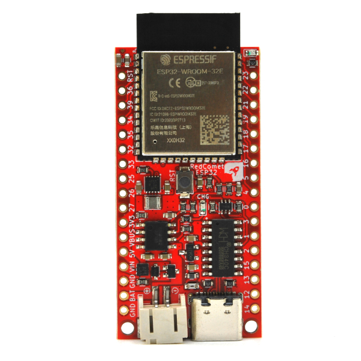

# Red Comet ESP32

An ultra low power ESP32 board. The board is able to run from variety type of battery below and above it's 3.3V operating voltage. This allow batteries such as 3xNiMH or 4xNiMH, Li-Ion/Pol, 3 or 4 alkaline and LiFePO4 to be used. Board sleep at 13.0 uA with charger off.
